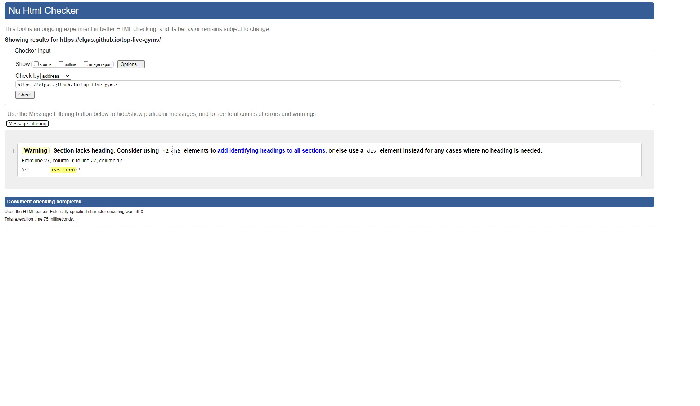
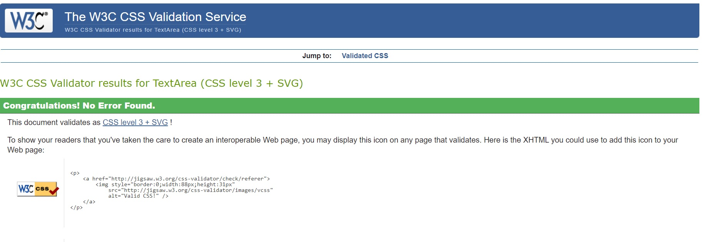
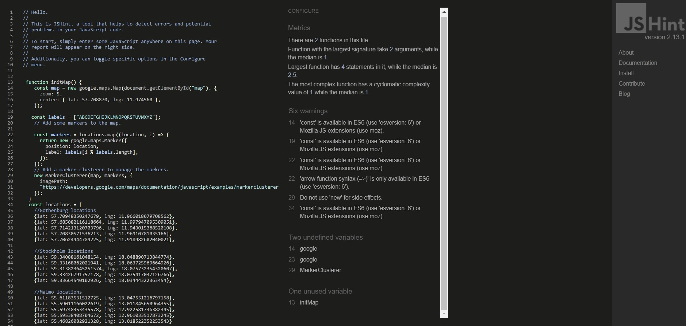
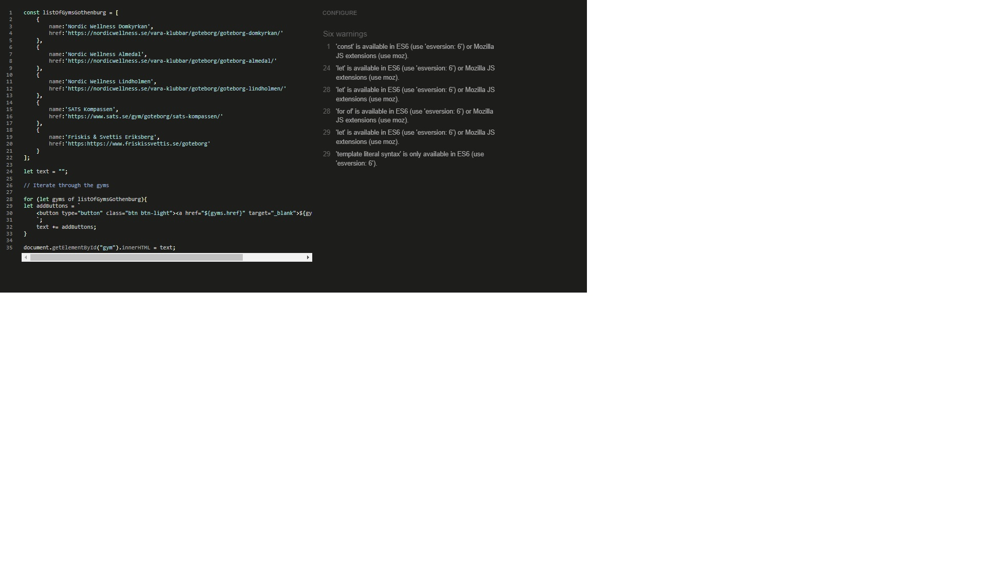
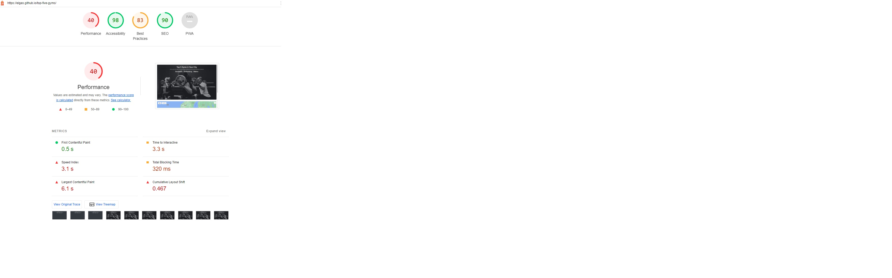

<h1 align="center">Top 5 Gyms in Your City Website</h1>

 [View the live project here.](https://elgas.github.io/top-five-gyms/)

The Top 5 Gyms website offers the possibility for the user to see the best gyms available in the city of Stockholm, Gothenburg and Malmo (Sweden).

    

- ## User Stories

    -   #### First time user
        1. As a firts time user, I would want the website to be clear and easy on how it works.
        2. As a first time user, I would like to see the best gyms that the website mentions.
        3. As a first time user, I want the website to redirect to the best gyms in Swedens biggest cities.
        4. As a first time user, I want to see marked gyms on the map in the city of Stockholm, Gothenburg and Malmo, so I can decide which one is in the part of the city I like.

    -    #### Returning Visitor Goals

        1. As a Returning Visitor, I want to find information about any updates on the gyms in my city.
        2. As a Returning Visitor, I want to find see if the gym I am at is on the top list.
    
    -   #### Frequent User Goals
        1. As a Frequent User, I want to check to see if there are any new gyms in my city.
        2. As a Frequent User, I want to check to see if there are any new features to the website. 

-   ### Design
    -   #### Colour Scheme
        -   The two main colours are used, black and white, in contrast to one another.
    -   #### Imagery
        -   The Background hero image is used to catch the user's attention immediately. At the same time it convays that this website is designed for a topic related to gyms. The image has a sense intrigue and simplicity.

*   ### Wireframes

    -   Home Page Wireframe - 

### Frameworks, Libraries & Programs Used

1. [Bootstrap 4.4.1:](https://getbootstrap.com/docs/4.4/getting-started/introduction/)
    - Bootstrap was used to assist with the responsiveness and styling of the website.
1. [Font Awesome:](https://fontawesome.com/)
    - Font Awesome was used on all pages throughout the website to add icons for aesthetic and UX purposes.
1. [jQuery:](https://jquery.com/)
    - jQuery came with Bootstrap to make the navbar responsive but was also used for the smooth scroll function in JavaScript.
1. [Git](https://git-scm.com/)
    - Git was used for version control by utilizing the Gitpod terminal to commit to Git and Push to GitHub.
1. [GitHub:](https://github.com/)
    - GitHub is used to store the projects code after being pushed from Git.
1. [Balsamiq:](https://balsamiq.com/)
    - Balsamiq was used to create the [wireframes](https://github.com/) during the design process.
1. [Places API key:](https://developers.google.com/maps/documentation/embed/get-api-key)
    - Google maps Api key was used in oreder to display a map on each page, and markers for locations.
    - Google turorial was used during the coding process.

## Testing

The W3C Markup Validator and W3C CSS Validator Services were used to validate every page of the project to ensure there were no syntax errors in the project.
No error was found.

-   [W3C Markup Validator](https://validator.w3.org/nu/#l27c34) - 
-   [W3C CSS Validator](https://jigsaw.w3.org/css-validator/validator) - )
-   [Java Script Validator](https://jshint.com/) - ,
 

### Testing User Stories from User Experience (UX) Section

-   #### First Time Visitor Goals

        1. As a First Time Visitor, I would want the website to be clear and easy on how it works.

        The main points are made immediately with the hero image, with clickabel links to the cities page with the list of gyms.
        The user has two options, click the buttons or scroll down to see a map with markers of the three cities.

        2. As a First Time Visitor, I would like to see the best gyms that the website mentions.

        When the user clicks the city names buttons, they are ridirected to the page with the list of gyms of that city.

        3. As a First Time Visitor, I want the website to redirect to the best gyms in Swedens biggest cities.
        Once the user is on the specific city page, they can see a list of gyms, and when they click on one, they are ridirected to the gym's webpage.

-   #### Returning Visitor Goals

        1. As a Returning Visitor, I want to find information about any updates on the gyms in my city and see if the gym I am at is on the top list.

        A returned user can check the list of the gyms showned, and see if they want to check another gym mentioned in this website as a top one.

    
-   #### Frequent User Goals

        1. As a Frequent User, I want to check to see if there are any new gyms inn my city.

        The user can do this by checking the list of their city.

        2. As a Frequent User, I want to check to see if there are any new features to the website.

        The user would already be familiar with the website layout and will see any new features added in the future.

### Further Testing

-   The Website was tested on Google Chrome, Internet Explorer browsers.
-   The website was viewed on a variety of devices such as Desktop, Laptop, iPhone7, iPhone 5.
-   Manually tested all links to ensure that all websites were linking correctly to the respective gyms.
-   Lighthouse testing 

### Fixed Bugs

-   On small devices the text on the Hero Image used to overflow, by adding media queiries now the text fits the container and it's responsive.
    
          
## Technologies

### Language Used
    -HTML5
    -CSS
    -JavaScript

## Deployment
The project was deployed to GitHub Pages using the following steps:

- Log in to GitHub and locate and open the wanted GitHub repository.
- In the GitHub repository navigate to the Settings tab.
- From the source section drop-down menu, select the Master Branch
- Next select folder and click on the save button. 
- The page automatically refreshes with a message to indicate 
the successful deployment.
- Wait a few minutes and then you can click the link that Github 
has created for hosting the website.

## Clonig

- Log in to GitHub and locate the GitHub repository that you want to clone.
- Click the "Code" button to copy the given URL.
- Open "Git Bash" and change the current working directory to the location where you want the cloned directory.
- Type git clone in the terminal, paste the URL you copied earlier, and press “enter” to create your local clone. (type: git clone {repository URL})
- git-clone: clones a repository into a new directory.

# Credits
## Code
    Bootstrap 4.4.1 Library was used throughout the project mainly to make site responsive and appealing.
    [Google Tutorial](https://developers.google.com/maps/documentation/javascript/marker-clustering) Library was used throughout the project in order to implement the maps API features.

## Content & Media
The content was written by the developer.
Free image source [Unsplash](unsplash.com)

## Acknowledgements
The team from CodeInstitute for their support and motivation.
My Mentor for continuous helpful guidance and support.

